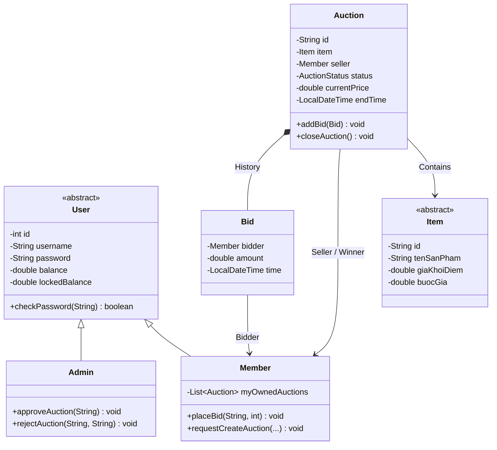
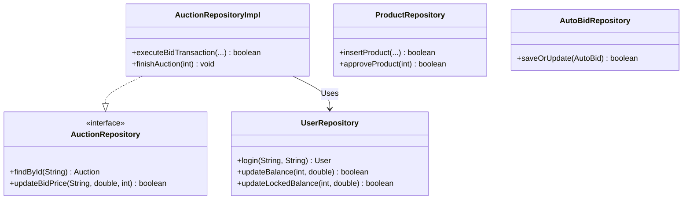
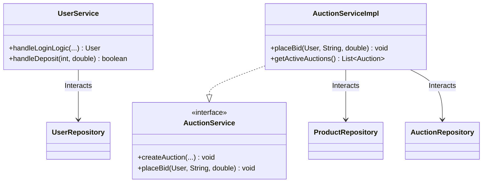
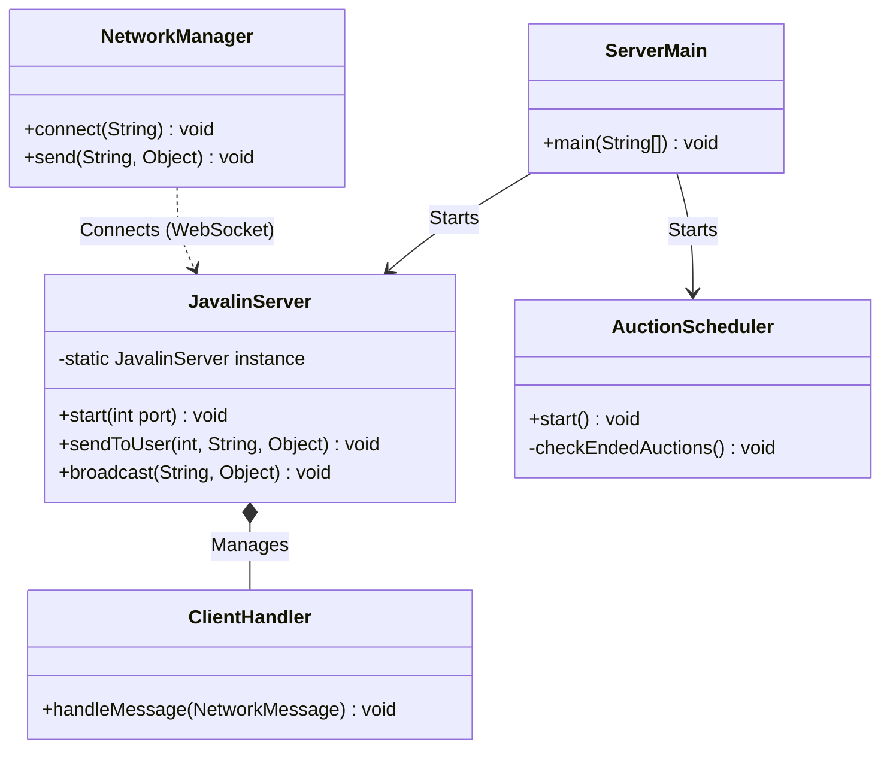

#   Hệ thống Đấu Giá Trực Tuyến - Nhóm 2

## 👥 Danh sách thành viên (Nhóm 2)

| MSSV       | HỌ VÀ TÊN             | VAI TRÒ                         |
|:-----------|:----------------------|:--------------------------------|
| `25021616` | Hoàng Đức Anh         | Nhóm trưởng / Backend Developer |
| `25021700` | Phạm Hải Dương        | Frontend Developer (JavaFX)     |
|            | Cao Trí Dũng          | Database & SQL Developer        |
| `25021881` | Nguyễn Văn Dương Minh | Tester & Documentation          |

## 1. Mô tả bài toán và Phạm vi hệ thống

Dự án này triển khai một **hệ thống đấu giá trực tuyến** nơi người bán có thể đăng tải sản phẩm, tạo các phiên đấu giá và người mua có thể tham gia trả giá, thiết lập tự động trả giá (auto-bidding) và nhận thông báo theo thời gian thực. Hệ thống được xây dựng dưới dạng ứng dụng Client-Server trên desktop: Client giao diện JavaFX giao tiếp với Backend Javalin thông qua REST APIs và các kênh WebSocket. Backend lưu trữ dữ liệu thông qua MySQL, kết hợp JDBC thuần túy và Flyway để quản lý khởi tạo cấu trúc dữ liệu.

**Phạm vi hệ thống (System scope):**

| Phân hệ (Area) | Phạm vi đã bao gồm (Included scope) |
| :--- | :--- |
| **Quản lý người dùng** | Đăng ký, đăng nhập, mã hóa mật khẩu (SHA-256) và phân quyền bảo mật cho 2 vai trò chính: `ADMIN` và `MEMBER` (bao gồm tư cách Người bán và Người mua). |
| **Quản lý sản phẩm** | Người bán tạo mới, xem danh sách sản phẩm theo phân loại (Nghệ thuật, Điện tử, Bất động sản...); Admin có quyền phê duyệt (`APPROVED`) hoặc từ chối (`REJECTED`) để sản phẩm được đưa lên sàn. |
| **Quản lý đấu giá** | Máy chủ quản lý toàn bộ vòng đời phiên đấu giá thông qua Scheduler ngầm: từ `PENDING` → `OPEN` → `FINISHED` hoặc `CANCELLED`. Tự động chốt sổ và xử lý tài chính khi hết giờ. |
| **Hệ thống đặt giá** | Đặt giá thủ công (Manual bidding), Tự động đặt giá (Auto-bidding) theo ngân sách (Max Limit), Lịch sử đặt giá, Cơ chế chống nẫng tay trên (Anti-snipping - tự động cộng thêm 45 giây). |
| **Cập nhật Realtime** | Gửi và nhận thông báo qua WebSocket cho mọi thay đổi về giá, thời gian kết thúc, trạng thái sản phẩm và cập nhật lại số dư ví hoàn toàn tự động không cần tải lại trang. |
| **Nghiệp vụ Quản trị** | Khóa/mở khóa tài khoản thành viên vi phạm, kiểm duyệt các phiên đấu giá, thống kê báo cáo doanh thu và tổng số lượt tham gia trên toàn hệ thống. |
| **Hạ tầng CSDL** | Sử dụng MySQL Server làm Database Runtime chính, truy xuất trực tiếp bằng JDBC Driver để tối ưu hiệu năng; quản lý khởi tạo và chuyển đổi cấu trúc bảng qua thư viện Flyway migrations. |
| **Kiểm soát tính nhất quán**| Sử dụng Transaction SQL (`conn.setAutoCommit(false)`), quản lý chặt chẽ **Số dư khả dụng (`balance`)** và **Số dư bị khóa (`locked_balance`)** khi đang đặt cược, đảm bảo không thất thoát hay xung đột dòng tiền. |

## 2. Công nghệ sử dụng, Môi trường chạy và Yêu cầu cài đặt

**Bảng thống kê Công nghệ & Môi trường (Technology & Runtime):**

| Danh mục | Công nghệ / Yêu cầu chi tiết |
| :--- | :--- |
| **Ngôn ngữ cốt lõi** | Java 21 (Tận dụng các luồng ảo - Virtual Threads & tối ưu hiệu suất) |
| **Giao diện Client (UI)** | JavaFX 21 (modules: `javafx.controls`, `javafx.fxml`); FXML + CSS tùy chỉnh giao diện hiện đại. |
| **Máy chủ Backend** | Javalin (Cung cấp REST API + WebSocket cho thời gian thực) |
| **Xử lý chuỗi JSON** | Google Gson (Serialize/Deserialize đối tượng thành chuỗi JSON và ngược lại) |
| **Database Runtime** | MySQL Server 8.0+ (Hoạt động trên cổng mặc định `3306`) |
| **Trình kết nối CSDL (Driver)** | MySQL Connector/J JDBC Driver |
| **Quản lý Migration** | Flyway Core (Tự động đọc các file SQL từ `src/main/resources/db/migration`) |
| **Truy xuất dữ liệu (DAO)** | JDBC nguyên bản (Sử dụng PreparedStatement để chống SQL Injection, ResultSet) |
| **Bảo mật mã hóa** | Thuật toán mã hóa mật khẩu SHA-256 (Tự xây dựng trong package util) |
| **Công cụ Build & Quản lý**| Apache Maven |
| **Đóng gói Fat JAR** | Maven Assembly Plugin / Maven Shade Plugin |
| **Kiểm thử (Testing)** | JUnit 5 |
| **Hệ điều hành tương thích**| Windows 10+ / macOS / Linux (Bắt buộc cài đặt sẵn JDK 21+) |

**Yêu cầu cài đặt bắt buộc:**
1. Cài đặt **Java JDK 21+**. Đảm bảo lệnh `java -version` chạy thành công trên terminal.
2. Cài đặt và bật **MySQL Server** trên máy tính khởi chạy Server. Mặc định hệ thống kết nối với port `3306`, user là `root` và mật khẩu rỗng (Có thể chỉnh sửa thông số này tại file `Team2_CS2_Auction.util.DBConnection`).

## 3. Cấu trúc thư mục chính (MVC Architecture)

Dự án tuân thủ nghiêm ngặt mô hình **MVC (Model-View-Controller)** và thiết kế phân lớp. Cấu trúc mã nguồn chính nằm trong thư mục `src/main/java/Team2_CS2_Auction/`:

```text
Team2_CS2_Auction/
├── Controller/     # Bộ điều khiển sự kiện giao diện (JavaFX Controllers)
├── Model/          # Định nghĩa thực thể dữ liệu (User, Product, Auction, Bid...)
├── Networking/     # Lõi giao tiếp mạng Client-Server (Socket, WebSocket, JSON)
├── Repository/     # Lớp truy xuất cơ sở dữ liệu JDBC (DAO)
├── Service/        # Lớp nghiệp vụ xử lý logic (Business Logic)
├── Session/        # Quản lý phiên đăng nhập cục bộ trên RAM của máy khách
└── util/           # Các tiện ích hệ thống (Database Connection, Hash, Alerts)
```

*Ngoài ra: Thư mục `src/main/resources/` chứa toàn bộ tài nguyên giao diện FXML, CSS, hình ảnh và thư mục `db/migration` chứa các script SQL khởi tạo tự động của Flyway.*

## 4. Sơ đồ Kiến trúc & Lớp (Class Diagram)

Hệ thống được chia thành 4 phân hệ chính theo chiều dọc để đảm bảo sự tách bạch, to và rõ ràng.

### 4.1. Phân hệ 1: Mô hình Dữ liệu Cốt lõi (Core Domain Model)


### 4.2. Phân hệ 2: Lớp Truy xuất Cơ sở dữ liệu (Repository Layer)


### 4.3. Phân hệ 3: Lớp Nghiệp Vụ (Service Layer)


### 4.4. Phân hệ 4: Giao tiếp Mạng & Xử lý ngầm (Networking & System Utils)


### 4.5. Giải thích chi tiết kiến trúc Hệ thống

Hệ thống được thiết kế theo nguyên lý **Phân tách trách nhiệm (Separation of Concerns)**, tổ chức thành các tầng (layer) riêng biệt nhằm tối ưu khả năng bảo trì và mở rộng:

> 🗄️ **1. Tầng Dữ liệu (Domain Models & Repositories)**
> - **Domain Models:** Các thực thể như `User`, `Item`, `Auction` được thiết kế hướng đối tượng (OOP). Áp dụng **Factory Pattern** (`ItemFactory`) để khởi tạo đa dạng loại sản phẩm.
> - **Repository Layer:** Tương tác trực tiếp với MySQL qua JDBC. Tách biệt hoàn toàn các tác vụ truy vấn, cập nhật cho Người dùng, Sản phẩm và Phiên đấu giá.

> ⚙️ **2. Tầng Nghiệp vụ (Service Layer)**
> - Đóng vai trò trung tâm điều phối luồng dữ liệu. Lớp `AuctionServiceImpl` kiểm soát vòng đời phiên đấu giá, thuật toán đặt giá thầu, quản lý và đảm bảo an toàn tuyệt đối số dư tài khoản của thành viên.

> 🌐 **3. Tầng Giao tiếp (Networking & Schedulers)**
> - **Client-Server Communication:** Giao tiếp TCP tốc độ cao, đóng gói dữ liệu dạng **JSON** qua Google Gson. Máy chủ xử lý đa luồng (Multi-threading) thông qua các `ClientHandler`.
> - **AuctionScheduler:** Luồng hệ thống chạy ngầm đếm ngược thời gian, tự động chốt sổ và thanh toán tiền khi phiên đấu giá kết thúc mà không cần bất kỳ sự can thiệp nào của con người.

---

## 5. Vị trí các file .jar
- **Server**: `server.jar`
- **Client**: `client.jar`

## 6. Hướng dẫn chạy Server/Client theo thứ tự cụ thể
Để hệ thống hoạt động chính xác, **bạn phải chạy Server trước, sau đó mới chạy Client**.

### Bước 1: Khởi động Server
Mở terminal tại thư mục chứa file jar và chạy lệnh sau:
```bash
java -jar server.jar
```
*Lưu ý: Terminal của Server sẽ in ra địa chỉ IP LAN của máy chủ. Bạn hãy copy hoặc ghi nhớ IP này để Client kết nối.*

### Bước 2: Khởi động Client
Mở một terminal khác và chạy lệnh sau:
```bash
java -jar client.jar
```
*Lưu ý: Tại màn hình Client, khi được yêu cầu, hãy nhập đúng địa chỉ IP mà Server đã hiển thị.*

## 7. Danh sách chức năng ĐÃ HOÀN THÀNH (Đầy đủ 100%)

Hệ thống đã vượt qua các bộ kiểm thử tự động (Unit Test) và kiểm tra chức năng hoàn thiện với các điểm nhấn đặc biệt về mặt kỹ thuật:

| Cụm tính năng chính                | Mô tả chi tiết mức độ hoàn thiện | Trạng thái |
|:-----------------------------------| :--- | :---: |
| 🔐 **Quản lý người dùng**          | Đăng nhập/Đăng ký phân quyền chặt chẽ giữa Member và Admin. Hỗ trợ mã hóa mật khẩu an toàn. | ✅ |
| 💰 **Tài chính & Ví điện tử**      | Yêu cầu nạp tiền, quản lý tách biệt **Số dư thực (Balance)** và **Số dư tạm giữ (Locked Balance)** khi đang cược. | ✅ |
| 📦 **Giao thương Sản phẩm**        | Tạo yêu cầu đăng bán sản phẩm theo nhiều phân loại (Nghệ thuật, Bất động sản...). Trạng thái Pending chờ Admin duyệt. | ✅ |
| 🛡️ **Quản trị (Admin Panel)**     | Giao diện quản lý riêng. Duyệt/Từ chối sản phẩm, Khóa/Mở khóa người dùng vi phạm, xem thống kê doanh thu toàn sàn. | ✅ |
| ⚡ **Đấu giá Real-time** | Mọi lệnh "Đặt Giá" lập tức được đồng bộ và hiển thị lên màn hình của **tất cả người dùng khác** trong mạng qua WebSockets. | ✅ |
| 📈 **Bid History Visualization** | Vẽ biểu đồ biến động giá (Realtime Price Curve) cập nhật liên tục theo thời gian thực mỗi khi có lượt trả giá mới. | ✅ |
| 🤖 **Trợ lý Auto-Bid** | Tự động trả giá: Thiết lập "Giá Trần" (Max Limit), máy chủ sẽ tự động ra giá thay người dùng khi bị đối thủ vượt mặt. | ✅ |
| ⏱️ **Chống Anti-Snipping** | Ngăn chặn nẫng tay trên phút chót: Tự động cộng thêm 45 giây nếu có người đặt giá thành công trong 45 giây cuối cùng. | ✅ |
| 💳 **Thanh toán ngầm tự động** | `AuctionScheduler` tự động chốt phiên khi hết giờ: Trừ tiền người thắng, cộng tiền người bán, hoàn tiền người thua, và **bắn tín hiệu cập nhật số dư** lên màn hình lập tức. | ✅ |

## 8. Link Báo cáo PDF và Video Demo
*Bộ tài liệu hoàn thiện dùng để đánh giá và chấm điểm đồ án:*

- **Link báo cáo PDF chi tiết:** [https://drive.google.com/file/d/1OzgB3_VJ3_wY1fcO8sg43OA8Tv2VOvCP/view?usp=sharing]

