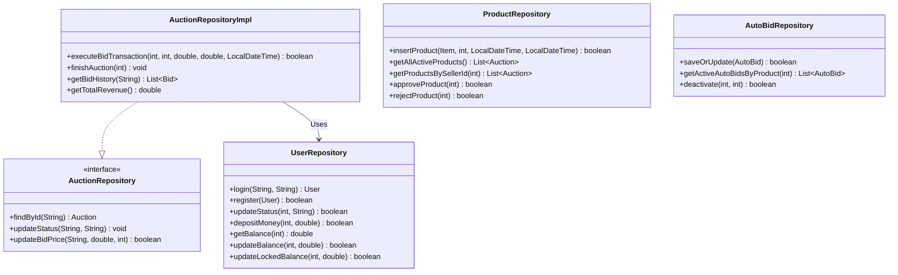
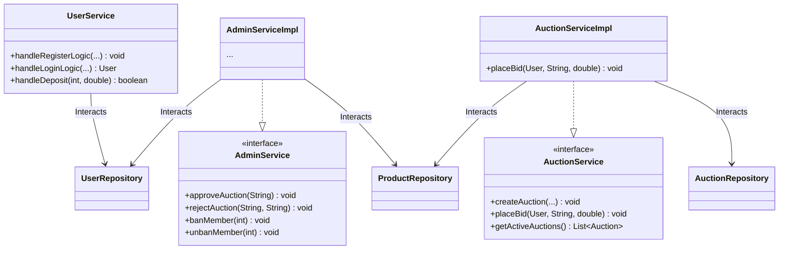
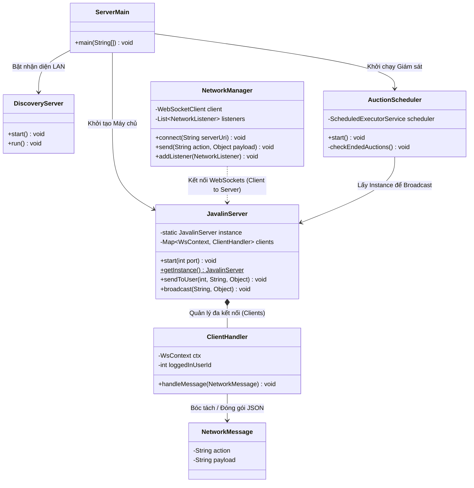

# 🔨 Hệ thống Đấu Giá Trực Tuyến (Online Auction System) - Nhóm 2

Dự án **Hệ thống Đấu Giá Trực Tuyến** là một hệ thống phần mềm toàn diện, áp dụng mô hình Client-Server. Hệ thống cung cấp nền tảng giao dịch tài sản theo thời gian thực (real-time bidding) với độ trễ thấp, minh bạch, bảo mật dữ liệu và kiến trúc hướng đối tượng chặt chẽ.

---

## 🎯 1. Mô tả bài toán và Phạm vi hệ thống

### 1.1. Bài toán đặt ra
Trong thời đại số, nhu cầu đấu giá các vật phẩm (Nghệ thuật, Điện tử, Bất động sản...) qua mạng đang tăng cao. Yêu cầu lớn nhất của một hệ thống đấu giá là **tính tức thời**: khi một người đặt giá, tất cả những người tham gia khác phải ngay lập tức nhìn thấy giá mới nhất mà không cần tải lại trang, đồng thời hệ thống phải tự động tính toán thời gian, chống hành vi gian lận và thanh toán một cách minh bạch.

### 1.2. Phạm vi hệ thống
Hệ thống được chia thành hai thực thể độc lập nhưng giao tiếp liên tục:
- **Server (Máy chủ - Backend):** Chịu trách nhiệm quản lý toàn bộ luồng nghiệp vụ. Nhận kết nối, quản lý các phiên bản WebSocket, đồng bộ hóa dữ liệu xuống MySQL, chạy tiến trình đếm ngược thời gian, và kích hoạt các lệnh thanh toán tự động khi phiên đấu giá khép lại.
- **Client (Máy khách - Frontend):** Được xây dựng bằng JavaFX, cung cấp giao diện tương tác trực quan cho 2 vai trò chính:
  - **Member (Người dùng):** Đăng ký/đăng nhập, quản lý ví tiền (số dư thực và số dư bị khóa), đăng tải sản phẩm, đặt giá thủ công hoặc thiết lập **Auto-bid** (hệ thống tự động trả giá thay người dùng).
  - **Admin (Quản trị viên):** Kiểm duyệt sản phẩm đăng bán (Duyệt/Từ chối), khóa/mở khóa các thành viên vi phạm, theo dõi biểu đồ thống kê tổng quan (doanh thu, số lượng người tham gia).

---

## 🚀 2. Công nghệ sử dụng, Môi trường chạy & Yêu cầu cài đặt

- **Công nghệ cốt lõi:**
  - **Ngôn ngữ:** Java 21 (Tận dụng Virtual Threads & tối ưu hóa luồng).
  - **Giao diện (Client):** JavaFX 21 (FXML + CSS tùy chỉnh UI hiện đại).
  - **Máy chủ & Mạng:** Javalin (cung cấp REST API & WebSocket cho giao tiếp thời gian thực 2 chiều).
  - **Cơ sở dữ liệu:** MySQL 8.0, truy xuất thông qua JDBC Driver thuần túy (Hiệu năng cao).
  - **Connection Pool:** HikariCP (quản lý kết nối DB hiệu suất cao).
  - **Quản lý Database Migration:** Flyway (Tự động hóa việc tạo bảng và chèn dữ liệu mẫu ngay lần chạy đầu tiên).
  - **Xử lý dữ liệu:** Google Gson (Serialize/Deserialize đối tượng thành chuỗi JSON).
  - **Trình quản lý dự án & Build:** Apache Maven (với `maven-shade-plugin` để đóng gói Fat JAR).
  - **Database Hosting:** [Railway](https://railway.app) — MySQL được host trên cloud, **không cần cài MySQL cục bộ**.
- **Môi trường chạy:** Tương thích đa nền tảng (Windows, macOS, Linux).
- **Yêu cầu duy nhất để chạy:**
  - ✅ **Java JDK 21** đã được cài đặt — [Tải tại đây](https://www.oracle.com/java/technologies/downloads/#java21).
  - ✅ **Kết nối Internet** — ứng dụng tự động kết nối đến database cloud, không cần cài thêm gì.
  - ❌ **Không cần cái MySQL** — Database đã được host sẵn trên Railway cloud.


---

## 📁 3. Cấu trúc thư mục và Module chính

Dự án áp dụng chặt chẽ mô hình **MVC (Model-View-Controller)** và thiết kế phân lớp (Layered Architecture):

```text
Team2_CS2_Auction/
 ├── Controller/                         # (Controller) Các lớp điều khiển JavaFX. Lắng nghe sự kiện click, xử lý giao diện (UI) và gọi các Service.
 │    ├── Base_Admin_Controller.java     # Lớp cha chứa logic chuyển trang và menu.
 │    ├── Phien_Dau_Gia_Controller.java  # Màn hình phòng đấu giá trực tiếp (Real-time).
 │    └── ...
 ├── Model/                              # (Model) Định nghĩa các thực thể dữ liệu cốt lõi, áp dụng OOP mạnh mẽ.
 │    ├── auction/                       # Auction, Bid, AutoBid, AuctionStatus...
 │    ├── item/                          # Item (Abstract), Art, Electronics... và ItemFactory.
 │    └── user/                          # User (Abstract), Member, Admin, UserRole, IBidder, ISeller...
 ├── Networking/                         # Xử lý giao tiếp mạng (LAN/Internet).
 │    ├── JavalinServer.java             # Server chính lắng nghe WebSocket và API.
 │    ├── ClientHandler.java             # Quản lý từng kết nối riêng lẻ của Client trên Server.
 │    ├── NetworkManager.java            # (Phía Client) Quản lý kết nối tới Server.
 │    ├── AuctionScheduler.java          # Vòng lặp ngầm 5 giây/lần kiểm tra phiên hết hạn.
 │    └── DiscoveryServer/Client         # UDP Broadcast để tự động dò tìm IP Máy chủ trong mạng LAN.
 ├── Repository/                         # Tương tác trực tiếp với Database bằng lệnh SQL.
 │    ├── AuctionRepositoryImpl.java     # Cập nhật giá, thêm giao dịch, trừ/cộng tiền tự động.
 │    ├── UserRepository.java            # Xử lý số dư, đăng nhập.
 │    └── ...
 ├── Service/                            # Tầng Business Logic (Nghiệp vụ). Kiểm tra điều kiện trước khi gọi Repository.
 │    ├── AuctionServiceImpl.java
 │    ├── UserServiceImpl.java
 │    └── AdminServiceImpl.java
 ├── Session/                            # Quản lý phiên đăng nhập cục bộ trên RAM của ứng dụng Client (chứa CurrentUser).
 └── util/                               # Các công cụ hỗ trợ (Mã hóa SHA-256, Kết nối DB, Validation...).
```

---

## 📊 4. Sơ đồ Kiến trúc & Lớp (Class Diagram - Chi tiết nhất)

Hệ thống được chia thành 4 phân hệ chính theo chiều dọc để đảm bảo sự tách bạch, to và rõ ràng.

### 4.1. Phân hệ 1: Mô hình Dữ liệu Cốt lõi (Core Domain Model)
*Áp dụng tính Đa hình (Polymorphism), Kế thừa (Inheritance) và Factory Pattern để khởi tạo linh hoạt các sản phẩm.*


### 4.2. Phân hệ 2: Lớp Truy xuất Dữ liệu (Repository Layer)
*Chịu trách nhiệm trực tiếp gọi câu lệnh JDBC (INSERT, UPDATE, SELECT), kiểm soát Transaction và toàn vẹn số liệu tài chính.*



### 4.3. Phân hệ 3: Lớp Nghiệp Vụ (Service Layer)
*Cầu nối giữa Controller và Repository. Kiểm tra điều kiện (ví dụ: Số dư khả dụng có đủ để tham gia AutoBid không, mật khẩu có hợp lệ không) trước khi cấp quyền truy xuất.*



### 4.4. Phân hệ 4: Mạng, Máy chủ & Trạm điều phối (Networking & Scheduler)
*Xử lý toàn bộ logic đồng bộ thời gian thực (WebSocket) và tiến trình giám sát kết thúc phiên tự động.*



---

## 💿 5. Vị trí và Link tải các file .jar

Nhóm đã tự build sẵn hai file **Fat JAR** (đã bao gồm toàn bộ thư viện bên trong), commit trực tiếp vào thư mục gốc của repository. Có 2 cách để tải về:

### 📥 Cách 1: Tải file JAR trực tiếp

| File | Vai trò | Link tải thẳng |
|------|---------|----------------|
| `server.jar` | Máy chủ (Backend) | **[⬇️ Tải server.jar](https://github.com/25021616-sketch/Dau_Gia_Truc_Tuyen_Nhom2/raw/main/server.jar)** |
| `client.jar` | Máy khách (Frontend / UI) | **[⬇️ Tải client.jar](https://github.com/25021616-sketch/Dau_Gia_Truc_Tuyen_Nhom2/raw/main/client.jar)** |

> Sau khi tải về, đặt `server.jar` và `client.jar` cùng một thư mục, sau đó làm theo **Mục 6** để chạy.

### 🔨 Cách 2: Tự build lại từ source code

```bash
mvn clean package -DskipTests
# server.jar và client.jar sẽ được tạo tại thư mục gốc
```

---

## 🎯 6. Hướng dẫn chạy Server/Client theo thứ tự cụ thể

### ▶️ Cách 1: Chạy từ file `.jar` đã build sẵn

Mở **3 cửa sổ Terminal** tại thư mục gốc của dự án (nơi chứa `server.jar` và `client.jar`):

**[Terminal 1] — Khởi động Server:**
```bash
java -jar server.jar
```
Chờ đến khi màn hình in ra dòng:
```
SERVER ĐẤU GIÁ (JAVALIN) ĐÃ KHỞI ĐỘNG - CỔNG 8080
IP CỦA MÁY CHỦ (LAN): 192.168.x.x:8080
```

**[Terminal 2] — Khởi động Client thứ nhất:**
```bash
java -jar client.jar
```

**[Terminal 3] — Khởi động Client thứ hai (mô phỏng nhiều người dùng):**
```bash
java -jar client.jar
```

> **Tự động kết nối:** Client sử dụng UDP Discovery để tự nhận diện IP Server trong mạng LAN. Nếu tường lửa chặn UDP, ứng dụng sẽ hiển thị hộp thoại để nhập thủ công IP từ Terminal 1.

---

### ▶️ Cách 2: Chạy từ source code qua Maven Wrapper

**[Terminal 1] — Khởi động Server:**
```bash
# Windows
.\mvnw.cmd clean compile exec:java -Dexec.mainClass="Team2_CS2_Auction.Networking.ServerMain"

# macOS / Linux
./mvnw clean compile exec:java -Dexec.mainClass="Team2_CS2_Auction.Networking.ServerMain"
```

**[Terminal 2 & 3] — Khởi động mỗi Client:**
```bash
# Windows
.\mvnw.cmd compile exec:java -Dexec.mainClass="Team2_CS2_Auction.Main"

# macOS / Linux
./mvnw compile exec:java -Dexec.mainClass="Team2_CS2_Auction.Main"
```

> **Lần chạy đầu tiên:** Flyway tự động tạo database `auction_db` và toàn bộ bảng, không cần import SQL thủ công.

---

### 👤 Tài khoản thử nghiệm mặc định

| Vai trò | Username | Password |
|---------|----------|----------|
| Admin | `HaiDuong` | `haiduong123` |
| Member | `HDAnh` | `ducanh1234` |
| Member | `HDAdz` | `danh123` |

---

## 🏆 7. Danh sách chức năng đã hoàn thành

- [x] **Đăng ký / Đăng nhập** phân quyền chặt chẽ giữa Member và Admin. Mật khẩu được mã hóa SHA-256.
- [x] **Hệ thống Tài chính giả lập:** Nạp tiền, quản lý **Số dư thực** và **Số dư tạm giữ** khi tham gia đấu giá.
- [x] **Đăng sản phẩm đấu giá:** Người dùng tạo yêu cầu đăng bán (đa loại: Nghệ thuật, Bất động sản, Điện tử...). Sản phẩm vào trạng thái `PENDING` cho đến khi Admin duyệt.
- [x] **Admin Panel:** Duyệt/Từ chối sản phẩm, Khóa (Ban)/Mở khóa thành viên vi phạm.
- [x] **Đấu giá Thời gian thực (WebSocket):** Mọi lệnh đặt giá lập tức cập nhật lên màn hình tất cả người dùng mà không cần tải lại trang.
- [x] **Concurrent Bidding an toàn:** Sử dụng `SELECT ... FOR UPDATE` và JDBC Transaction đảm bảo tính nguyên tử khi nhiều người đặt giá cùng lúc, không xảy ra race condition.
- [x] **Auto-Bid (Trợ lý đấu giá tự động):** Người dùng thiết lập "Giá Trần". Khi bị vượt giá, Server tự động đặt lệnh mới thay mặt người dùng trong giới hạn cho phép.
- [x] **Anti-Snipping (Chống canh me cuối giờ):** Lệnh đặt giá thành công khi còn dưới 45 giây sẽ tự động gia hạn thêm 45 giây.
- [x] **Thanh toán tự động:** Khi phiên kết thúc, `AuctionScheduler` tự động trừ tiền người thắng, cộng tiền người bán, giải phóng locked balance cho người thua và phát tín hiệu WebSocket cập nhật số dư tức thì.
- [x] **UDP LAN Discovery:** Client tự động tìm và kết nối đến Server trong cùng mạng WiFi mà không cần cấu hình IP thủ công.
- [x] **Biểu đồ thống kê lượt đặt giá/sản phẩm:** Hiển thị biểu đồ trực quan về số lượt đặt giá và biến động giá cả thị trường của sản phẩm đó

---

## 📽️ 8. Link Báo cáo PDF và Video Demo
- **📄 Báo cáo PDF:** [https://drive.google.com/file/d/1KGs4fvBtexhyyEwe38ktycstkHb51GdX/view?usp=sharing]
- **🎬 Video Demo:** [https://drive.google.com/file/d/1OQDIAngdbkVYpS8ketRBNth_3qxYRFD9/view?usp=sharing]

---
