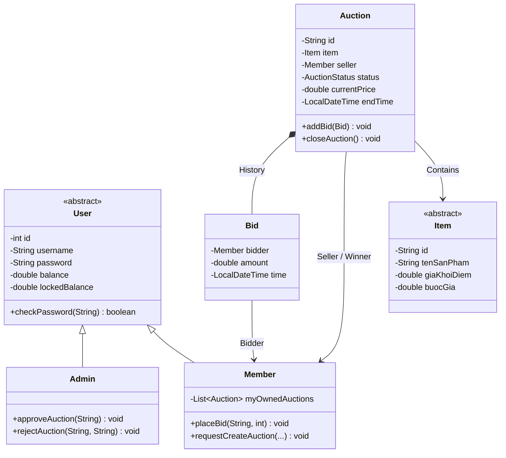
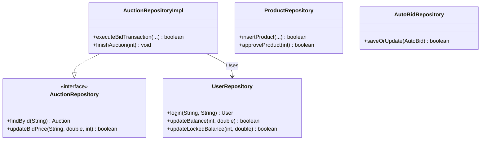
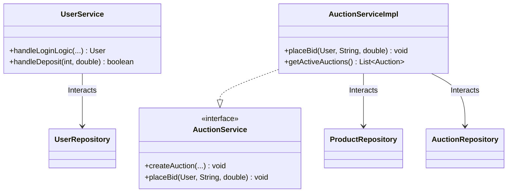
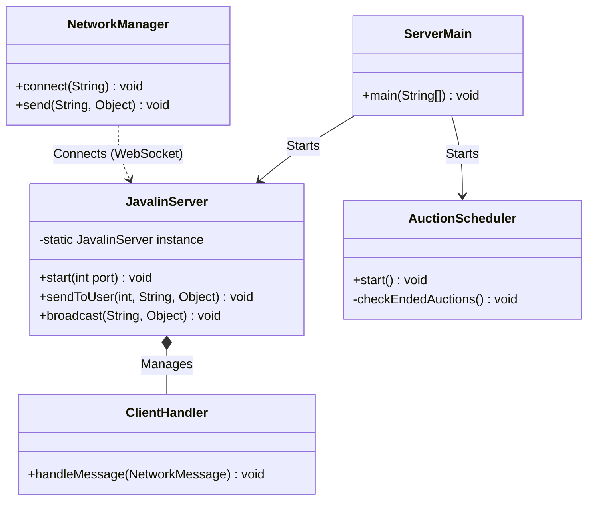

# Hệ thống Đấu Giá Trực Tuyến - Nhóm 2

## 1. Mô tả bài toán và phạm vi hệ thống
Hệ thống Đấu Giá Trực Tuyến (Online Auction System) là một ứng dụng Client-Server cho phép người dùng tham gia đấu giá các sản phẩm qua mạng. Hệ thống bao gồm hai thành phần chính:
- **Server**: Quản lý phiên đấu giá, thời gian, kết nối mạng và xử lý logic kết thúc phiên.
- **Client (Người dùng & Quản trị viên)**: Người dùng có thể đăng ký, đăng nhập, nạp tiền, đăng sản phẩm mới, xem danh sách sản phẩm và tham gia đấu giá (đặt giá realtime). Quản trị viên có quyền quản lý người dùng, quản lý đấu giá và xem lịch sử.

## 2. Công nghệ sử dụng, môi trường chạy và yêu cầu cài đặt
- **Ngôn ngữ**: Java 21
- **Giao diện**: JavaFX (Client)
- **Quản lý project**: Maven
- **Cơ sở dữ liệu**: MySQL (Sử dụng JDBC & Flyway cho Database Migration)
- **Giao tiếp mạng**: Socket Programming & Gson (JSON)
- **Yêu cầu cài đặt**:
  - **Java JDK 21** trở lên.
  - **MySQL Server** đang chạy (Database sẽ được Flyway tự động khởi tạo/migrate).

## 3. Cấu trúc thư mục chính
Dự án được xây dựng theo kiến trúc MVC với các package chính trong thư mục `src/main/java/Team2_CS2_Auction/`:
- `Controller`: Chứa các bộ điều khiển xử lý sự kiện giao diện (JavaFX Controllers).
- `Model`: Định nghĩa các thực thể dữ liệu (User, Product, Auction, ...).
- `Networking`: Logic giao tiếp mạng Client-Server (Socket, JSON payload).
- `Repository`: Lớp truy xuất cơ sở dữ liệu (JDBC).
- `Service`: Chứa logic nghiệp vụ của ứng dụng.
- `Session`: Quản lý phiên đăng nhập hiện tại của người dùng.
- `util`: Các lớp tiện ích (Database connection).
Ngoài ra: `src/main/resources` chứa các file FXML (giao diện), CSS và các file cấu trúc Flyway migration.

## 4. Sơ đồ Kiến trúc & Lớp (Class Diagram)

Hệ thống được chia thành 4 phân hệ chính theo chiều dọc để đảm bảo sự tách bạch, to và rõ ràng.

### 4.1. Phân hệ 1: Mô hình Dữ liệu Cốt lõi (Core Domain Model)


### 4.2. Phân hệ 2: Lớp Truy xuất Cơ sở dữ liệu (Repository Layer)


### 4.3. Phân hệ 3: Lớp Nghiệp Vụ (Service Layer)


### 4.4. Phân hệ 4: Giao tiếp Mạng & Xử lý ngầm (Networking & System Utils)


### 4.5. Giải thích chi tiết kiến trúc Hệ thống

Hệ thống được thiết kế theo nguyên lý phân lớp rõ ràng (Separation of Concerns) nhằm tối ưu khả năng mở rộng và bảo trì:
*   **Lớp Mô Hình Dữ Liệu (Domain Models)**: Định nghĩa các thực thể nghiệp vụ. `User` là lớp cha cho `Admin` và `Member` (thực thi `ISeller` để đăng bán và `IBidder` để đặt giá). `Item` đại diện cho sản phẩm, khởi tạo linh hoạt qua `ItemFactory` (áp dụng *Factory Pattern*). `Auction` và `Bid` quản lý trạng thái đấu giá thực tế.
*   **Lớp Lưu Trữ (Repository Layer)**: Tương tác trực tiếp với MySQL database bằng JDBC. Tách biệt rõ nhiệm vụ truy vấn người dùng (`UserRepository`), sản phẩm (`ProductRepository`), đấu giá tự động (`AutoBidRepository`) và phiên đấu giá (`AuctionRepositoryImpl`).
*   **Lớp Nghiệp Vụ (Service Layer)**: Điều phối xử lý nghiệp vụ. `AuctionServiceImpl` quản lý quy trình tạo phiên đấu giá và đặt giá thầu (bao gồm cả cơ chế kiểm tra và khóa/mở khóa số dư tài khoản). `UserService` quản lý đăng ký, đăng nhập và nạp tiền.
*   **Lớp Giao Tiếp Mạng (Networking)**: Sử dụng TCP Sockets và định dạng Gson JSON để truyền nhận dữ liệu thời gian thực giữa `AuctionServer` (phía Server, xử lý đa luồng qua các `ClientHandler`) và `NetworkManager` (phía Client JavaFX). Tiến trình ngầm `AuctionScheduler` kiểm tra và tự động đóng phiên đấu giá khi hết giờ.

---

## 5. Vị trí các file .jar
Các file thực thi fat JAR (đã bao gồm toàn bộ thư viện như JavaFX, MySQL Connector, Gson...) được build và nằm ở thư mục `target/`:
- **Server**: `target/MyAuctionApp-1.0-SNAPSHOT-server.jar`
- **Client**: `target/MyAuctionApp-1.0-SNAPSHOT-client.jar`

## 6. Hướng dẫn chạy Server/Client theo thứ tự cụ thể
Để hệ thống hoạt động chính xác, **bạn phải chạy Server trước, sau đó mới chạy Client**.

### Bước 1: Khởi động Server
Mở terminal tại thư mục gốc của dự án và chạy lệnh sau:
```bash
java -jar target/MyAuctionApp-1.0-SNAPSHOT-server.jar
```
*Lưu ý: Terminal của Server sẽ in ra địa chỉ IP LAN của máy chủ. Bạn hãy copy hoặc ghi nhớ IP này để Client kết nối.*

### Bước 2: Khởi động Client
Mở một terminal khác (có thể trên cùng một máy hoặc máy tính khác trong mạng) và chạy lệnh sau:
```bash
java -jar target/MyAuctionApp-1.0-SNAPSHOT-client.jar
```
*Lưu ý: Tại màn hình Client, khi được yêu cầu (hoặc trong phần cài đặt kết nối), hãy nhập đúng địa chỉ IP mà Server đã hiển thị.*

### Hướng dẫn tự Build lại file JAR (Dành cho nhà phát triển)
Nếu bạn có thay đổi mã nguồn và muốn tạo lại file JAR, hãy chạy lệnh Maven sau:
```bash
# Trên Windows
.\mvnw.cmd clean package -DskipTests

# Trên Linux/macOS
./mvnw clean package -DskipTests
```

## 7. Danh sách chức năng ĐÃ HOÀN THÀNH (Đầy đủ 100%)

Hệ thống đã vượt qua các bộ kiểm thử tự động (Unit Test) và kiểm tra chức năng hoàn thiện với các điểm nhấn đặc biệt:

- [x] **Hệ thống Định danh:** Đăng nhập/Đăng ký phân quyền chặt chẽ giữa Member và Admin. Hỗ trợ mã hóa mật khẩu an toàn.
- [x] **Hệ thống Tài chính giả lập:** Người dùng có thể yêu cầu nạp tiền, quản lý **Số dư thực (Balance)** và **Số dư tạm giữ (Locked Balance - khi tham gia đấu giá)**.
- [x] **Giao thương:** Người dùng tạo yêu cầu đăng bán sản phẩm (với đa dạng phân loại: Nghệ thuật, Bất động sản, Đồ điện tử...). Sản phẩm vào trạng thái chờ (Pending) cho đến khi Admin duyệt.
- [x] **Quản trị (Admin Panel):** Giao diện riêng biệt cho Admin. Cho phép Duyệt/Từ chối sản phẩm, Khóa (Ban) người dùng vi phạm, xem Biểu đồ thống kê lợi nhuận, lượt tham gia toàn sàn.
- [x] **Đấu giá Thời gian thực (WebSockets):** Mọi lệnh "Đặt Giá" của một người đều lập tức hiển thị lên màn hình của **tất cả người dùng khác** ở bất cứ đâu trong mạng LAN mà không cần F5 tải lại trang.
- [x] **Auto-Bid (Trợ lý Đấu giá Tự động):** Người dùng bận rộn có thể điền "Giá Trần" (Max Limit). Khi có đối thủ trả giá cao hơn, Máy chủ lập tức tự động đặt một lệnh giá mới thay mặt người dùng để vượt mặt đối thủ trong giới hạn cho phép.
- [x] **Anti-Snipping (Chống canh me cuối giờ):** Nếu một lệnh đặt giá thành công khi đồng hồ chỉ còn dưới 45 giây, hệ thống lập tức tự động cộng thêm 45 giây vào tổng thời gian, tạo cơ hội cho người bị vượt giá phản hồi.
- [x] **Thanh toán tự động 100%:** Luồng `AuctionScheduler` đếm ngược chính xác. Khi hết giờ, hệ thống ngầm tự động trừ tiền của người thắng, cộng tiền cho người bán, giải phóng số dư (Unlock Balance) cho những người thua và **phát tín hiệu WebSocket cập nhật số dư ngay lập tức lên màn hình** của người mua và người bán.

## 8. Link Báo cáo PDF và Video Demo
*Bộ tài liệu hoàn thiện dùng để đánh giá và chấm điểm đồ án:*

- **Link báo cáo PDF chi tiết:** [https://drive.google.com/file/d/1OzgB3_VJ3_wY1fcO8sg43OA8Tv2VOvCP/view?usp=sharing]
- **Link Video Hướng dẫn & Trình diễn thực tế:** [https://drive.google.com/file/d/1OQDIAngdbkVYpS8ketRBNth_3qxYRFD9/view?usp=sharing]

> ***Dự án được xây dựng với tâm huyết và áp dụng các mẫu thiết kế (Design Patterns) chuẩn xác nhất của kiến trúc phần mềm doanh nghiệp.***
