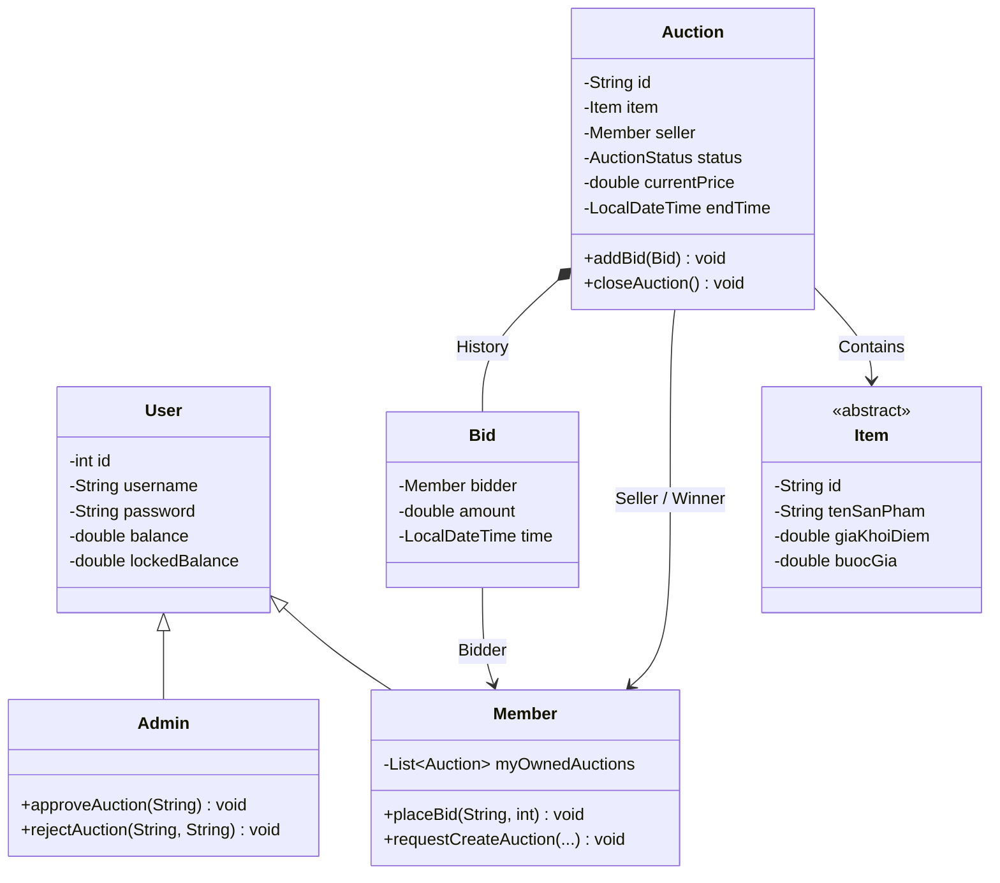
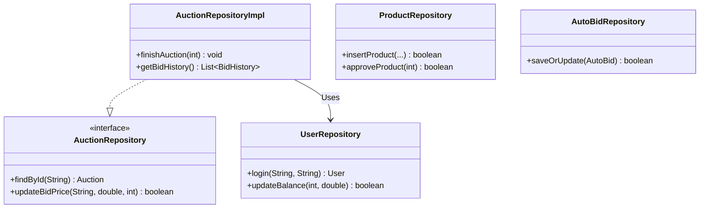
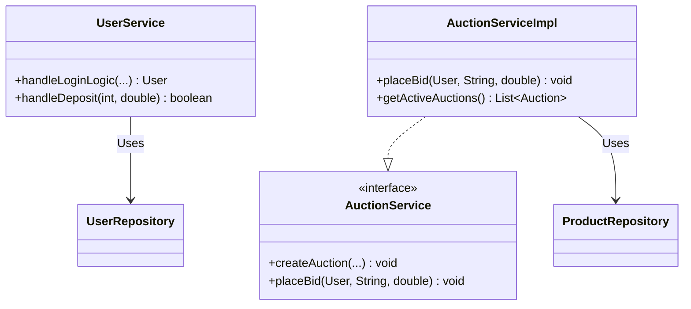
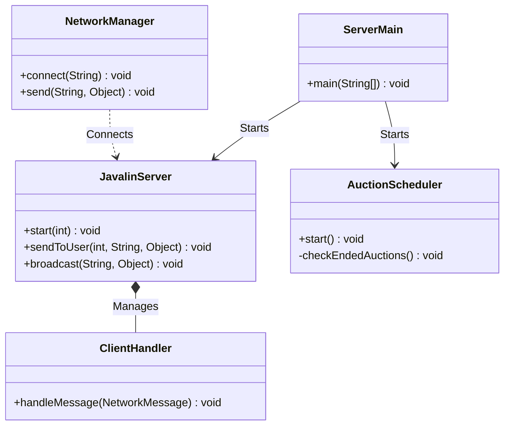

# 🔨 Hệ thống Đấu Giá Trực Tuyến (Online Auction System) - Nhóm 2

Dự án Hệ thống Đấu Giá Trực Tuyến là một nền tảng Client-Server mạnh mẽ, hỗ trợ đấu giá theo thời gian thực với độ trễ thấp, giao diện trực quan và tính toàn vẹn dữ liệu cao.

---

## 1. Mô tả ngắn gọn bài toán và phạm vi hệ thống
- **Bài toán:** Xây dựng nền tảng cho phép người dùng giao dịch, mua bán sản phẩm qua hình thức trả giá cạnh tranh minh bạch. Đảm bảo mọi thay đổi về giá và thời gian đều được đồng bộ ngay lập tức đến tất cả người tham gia mà không cần tải lại trang.
- **Phạm vi hệ thống:**
  - **Server (Máy chủ):** Xử lý logic trung tâm, quản lý thời gian đếm ngược, lưu trữ dữ liệu người dùng/sản phẩm, và phát sóng (broadcast) sự kiện qua WebSocket. Tự động thanh toán khi kết thúc phiên.
  - **Client (Máy khách):** Cung cấp giao diện JavaFX. 
    - **Member (Người dùng):** Đăng ký/đăng nhập, nạp tiền, đăng sản phẩm, đặt giá thầu thời gian thực, thiết lập tự động đặt giá (auto-bid).
    - **Admin (Quản trị viên):** Phê duyệt sản phẩm, quản lý tài khoản người dùng, xem thống kê và lịch sử giao dịch toàn hệ thống.

---

## 2. Công nghệ sử dụng, môi trường chạy và yêu cầu cài đặt
- **Công nghệ sử dụng:**
  - **Ngôn ngữ:** Java 21.
  - **Giao diện (Client):** JavaFX 21 (với FXML & CSS).
  - **Máy chủ & Mạng:** Javalin (REST API & WebSocket cho giao tiếp thời gian thực).
  - **Cơ sở dữ liệu:** MySQL 8.0 với JDBC.
  - **Quản lý Database Migration:** Flyway (Tự động khởi tạo schema).
  - **Xử lý dữ liệu:** Google Gson (JSON).
  - **Quản lý dự án:** Apache Maven.
- **Môi trường chạy:** Windows, macOS hoặc Linux.
- **Yêu cầu cài đặt:**
  - Java JDK 21 trở lên.
  - MySQL Server (đang chạy ở cổng 3306, user `root`, mật khẩu rỗng hoặc chỉnh sửa file `DBConnection.java` cho phù hợp).

---

## 3. Cấu trúc thư mục hoặc các module chính
Dự án tuân thủ mô hình **MVC** và được chia thành các module chính:
```text
src/main/java/Team2_CS2_Auction/
 ├── Controller/   # Lắng nghe sự kiện UI (JavaFX) và cập nhật giao diện.
 ├── Model/        # Các thực thể dữ liệu (User, Auction, Product, Bid...).
 ├── Networking/   # Giao tiếp mạng (Javalin Server, Socket Client, NetworkListener).
 ├── Repository/   # Tương tác Database (Thực thi truy vấn SQL).
 ├── Service/      # Logic nghiệp vụ trung tâm.
 ├── Session/      # Quản lý phiên đăng nhập hiện tại.
 └── util/         # Tiện ích hệ thống (Mã hóa, Kết nối CSDL).
src/main/resources/
 ├── Team2_CS2_Auction/example/myauctionapp/ # Nơi chứa giao diện FXML và CSS.
 └── db/migration/                           # Các file SQL để Flyway tự động tạo bảng.
```

---

## 4. Sơ đồ Kiến trúc & Lớp (Class Diagram)
Được chia thành 4 phần chiều dọc để dễ theo dõi.

### 4.1. Core Domain Model (Mô hình Thực thể)


### 4.2. Repository Layer (Truy xuất Database)


### 4.3. Service Layer (Logic Nghiệp vụ)


### 4.4. Networking & Utils (Mạng & Hệ thống)


---

## 5. Vị trí các file .jar
Mã nguồn sau khi được đóng gói (Build) sẽ cho ra các file thực thi định dạng `.jar`. Các file này (nếu đã được build) nằm tại thư mục `target/`:
- **File chạy Máy chủ (Server):** `target/MyAuctionApp-1.0-SNAPSHOT-server.jar` *(Nếu áp dụng cấu hình Maven shade)*
- **File chạy Máy khách (Client):** `target/MyAuctionApp-1.0-SNAPSHOT-client.jar` *(Hoặc tên file tương đương tùy cấu hình pom.xml)*

*(Lưu ý: Bạn cũng có thể chạy trực tiếp bằng trình quản lý gói Maven mà không cần phải compile ra `.jar`, xem mục 6).*

---

## 6. Hướng dẫn chạy Server/Client theo thứ tự cụ thể
Hệ thống mạng lưới bắt buộc **Máy chủ (Server) phải được khởi động trước tiên**, sau đó mới đến Máy khách (Client).

### 🛠️ Cách 1: Chạy trực tiếp từ Maven (Khuyên dùng)
**Bước 1: Khởi động Server**
Mở terminal ở thư mục gốc của dự án, chạy lệnh:
```bash
.\mvnw.cmd clean compile exec:java -Dexec.mainClass="Team2_CS2_Auction.Networking.ServerMain"
```
*Lưu ý: Lần đầu tiên chạy, hệ thống sẽ mất chút thời gian để Flyway kết nối tới MySQL và tự động tạo Database. Khi Server khởi động xong, nó sẽ in ra màn hình IP máy chủ (VD: `192.168.1.5:8080`).*

**Bước 2: Khởi động Client**
Mở một terminal MỚI (có thể trên máy khác cùng mạng WiFi), chạy lệnh:
```bash
.\mvnw.cmd clean compile exec:java -Dexec.mainClass="Team2_CS2_Auction.Main"
```
*Ghi chú: Giao diện Client sẽ tự động quét tìm máy chủ trong mạng LAN. Nếu không tìm thấy, hệ thống sẽ yêu cầu bạn nhập địa chỉ IP ở Bước 1 vào.*

### 📦 Cách 2: Chạy từ file .jar đã đóng gói
Nếu bạn đã build project sang file `.jar`, chạy tuần tự hai lệnh trên 2 terminal khác nhau:
1. `java -jar target/Tên_File_Server.jar`
2. `java -jar target/Tên_File_Client.jar`

---

## 7. Danh sách chức năng đã hoàn thành
- [x] Đăng ký, đăng nhập và bảo mật phân quyền (User/Admin).
- [x] Tính năng tài chính: Mô phỏng nạp tiền, quản lý số dư bị khóa (tiền đặt cọc/cược).
- [x] Mua/Bán sản phẩm: Gửi yêu cầu đăng bán sản phẩm và chờ Admin kiểm duyệt.
- [x] Đấu giá Thời gian thực (Real-time): Đồng bộ số tiền thầu ngay lập tức đến mọi thiết bị thông qua WebSocket.
- [x] Hệ thống Auto-bid: Cho phép người dùng đặt "giá trần". Máy chủ tự ra giá thay người dùng khi bị đối thủ vượt mặt.
- [x] Cơ chế Chống Snipping: Tự động gia hạn thêm 45 giây nếu có người đặt giá ở sát giờ kết thúc.
- [x] Xử lý tự động: Tự đóng phiên đấu giá, tính toán giao dịch, trừ tiền người thắng và chuyển tiền cho người bán.
- [x] Quản trị (Admin): Thống kê doanh thu, lịch sử đấu giá toàn sàn, chặn/mở khóa tài khoản.

---

## 8. Link báo cáo PDF và video demo
- **Link báo cáo PDF:** [Link PDF Báo Cáo - Sẽ bổ sung]
- **Link video demo:** [Link Video Demo - Sẽ bổ sung]
