# Hệ thống Đấu Giá Trực Tuyến - Nhóm 2

## 1. Mô tả bài toán và phạm vi hệ thống
Hệ thống Đấu Giá Trực Tuyến (Online Auction System) là một ứng dụng Client-Server cho phép người dùng tham gia đấu giá các sản phẩm qua mạng. Hệ thống bao gồm hai thành phần chính:
- **Server**: Quản lý phiên đấu giá, thời gian, kết nối mạng và xử lý logic kết thúc phiên.
- **Client (Người dùng & Quản trị viên)**: Người dùng có thể đăng ký, đăng nhập, nạp tiền, đăng sản phẩm mới, xem danh sách sản phẩm và tham gia đấu giá (đặt giá realtime). Quản trị viên có quyền quản lý người dùng, quản lý đấu giá và xem lịch sử.

## 2. Công nghệ sử dụng, môi trường chạy và yêu cầu cài đặt
- **Ngôn ngữ**: Java 21
- **Giao diện**: JavaFX (Client)
- **Quản lý project**: Maven
- **Cơ sở dữ liệu**: MySQL (Sử dụng JDBC & Flyway cho Database Migration)
- **Giao tiếp mạng**: Socket Programming & Gson (JSON)
- **Yêu cầu cài đặt**:
  - **Java JDK 21** trở lên.
  - **MySQL Server** đang chạy (Database sẽ được Flyway tự động khởi tạo/migrate).

## 3. Cấu trúc thư mục chính
Dự án được xây dựng theo kiến trúc MVC với các package chính trong thư mục `src/main/java/Team2_CS2_Auction/`:
- `Controller`: Chứa các bộ điều khiển xử lý sự kiện giao diện (JavaFX Controllers).
- `Model`: Định nghĩa các thực thể dữ liệu (User, Product, Auction, ...).
- `Networking`: Logic giao tiếp mạng Client-Server (Socket, JSON payload).
- `Repository`: Lớp truy xuất cơ sở dữ liệu (JDBC).
- `Service`: Chứa logic nghiệp vụ của ứng dụng.
- `Session`: Quản lý phiên đăng nhập hiện tại của người dùng.
- `util`: Các lớp tiện ích (Database connection).
Ngoài ra: `src/main/resources` chứa các file FXML (giao diện), CSS và các file cấu trúc Flyway migration.

## 4. Sơ đồ lớp (Class Diagram)

### 4.1. Bản vẽ Sơ đồ lớp (Class Diagram)

```mermaid
classDiagram
    %% ==========================================
    %% 1. CORE DOMAIN MODEL (Lớp Dữ Liệu & Thực Thể)
    %% ==========================================
    class User {
        -int id
        -String username
        -String password
        -String phone
        -UserRole role
        -LocalDateTime createdAt
        -String status
        -double balance
        -double lockedBalance
        +getInfo() String
        +checkPassword(String) boolean
    }
    
    class Member {
        -double balance
        -List~Auction~ myOwnedAuctions
        -List~Auction~ joinedAuctions
        -AuctionService auctionService
        -LocalDateTime createdAt
        +placeBid(String, int) void
        +requestCreateAuction(...) void
        +addOwnedAuction(Auction) void
        +addJoinedAuction(Auction) void
        +addBalance(double) void
        +subtractBalance(double) void
        +getInfo() String
    }
    
    class Admin {
        -AdminService adminService
        +approveAuction(String) void
        +rejectAuction(String, String) void
        +getInfo() String
    }
    
    class ISeller {
        <<interface>>
        +requestCreateAuction(Item, double, double, String) void
    }
    
    class IBidder {
        <<interface>>
        +placeBid(String, int) void
    }
    
    class UserRole {
        <<enumeration>>
        BIDDER
        SELLER
        MEMBER
        ADMIN
    }

    class Item {
        <<abstract>>
        -String id
        -String tenSanPham
        -String loaiSanPham
        -String moTa
        -String imagePath
        -double giaKhoiDiem
        -double buocGia
        -LocalDateTime ngayBatDau
        -LocalDateTime ngayKetThuc
    }

    class Art
    class Electronics
    class RealEstate
    class Vehicle
    class Other

    class ItemFactory {
        +createItem(String, String, String, String, String) Item
    }

    class Auction {
        -String id
        -Item item
        -Member seller
        -Member winner
        -AuctionStatus status
        -double currentPrice
        -double stepPrice
        -LocalDateTime startTime
        -LocalDateTime endTime
        -List~Bid~ bidHistory
        +addBid(Bid) void
        +openAuction() void
        +closeAuction() void
        +cancelAuction() void
        +rejectAuction() void
        +getCurrentBidderId() int
    }

    class AuctionStatus {
        <<enumeration>>
        PENDING
        APPROVED
        OPEN
        CLOSED
        REJECTED
        CANCELLED
    }

    class Bid {
        -String id
        -Member bidder
        -double amount
        -LocalDateTime time
    }

    class AutoBid {
        -int id
        -int userId
        -int productId
        -int stepMultiplier
        -double maxLimit
        -boolean active
        -double balance
    }

    class BidHistory {
        -int stt
        -String id
        -String productName
        -String winnerName
        -double finalPrice
        -String endTime
    }

    %% Các quan hệ của Lớp Domain Model
    User <|-- Member : Kế thừa (Inheritance)
    User <|-- Admin : Kế thừa (Inheritance)
    ISeller <|.. Member : Thực thi (Realization)
    IBidder <|.. Member : Thực thi (Realization)
    User --> UserRole : có vai trò (Association)
    Auction --> Item : chứa sản phẩm (Aggregation)
    Auction --> Member : người bán/người thắng (Association)
    Auction --> AuctionStatus : có trạng thái (Association)
    Auction *-- Bid : chứa lịch sử (Composition)
    Bid --> Member : người đặt giá (Association)
    Item <|-- Art : Kế thừa (Inheritance)
    Item <|-- Electronics : Kế thừa (Inheritance)
    Item <|-- RealEstate : Kế thừa (Inheritance)
    Item <|-- Vehicle : Kế thừa (Inheritance)
    Item <|-- Other : Kế thừa (Inheritance)
    ItemFactory ..> Item : tạo đối tượng (Dependency)

    %% ==========================================
    %% 2. REPOSITORY LAYER (Lớp Kết Nối Cơ Sở Dữ Liệu)
    %% ==========================================
    class UserRepository {
        +login(String, String) User
        +register(User) boolean
        +findAllMembers() List~Member~
        +updateStatus(int, String) boolean
        +depositMoney(int, double) boolean
        +getBalance(int) double
        +updateBalance(int, double) boolean
        +getLockedBalance(int) double
        +updateLockedBalance(int, double) boolean
        +getHighestBidderId(String) int
    }

    class AuctionRepository {
        <<interface>>
        +findById(String) Auction
        +findPendingAuctions() List~Auction~
        +updateStatus(String, String) void
        +updateBidPrice(String, double, int) boolean
        +findAuctionsByBidderId(int) List~Auction~
        +getBidHistory(String) List~Bid~
    }

    class AuctionRepositoryImpl {
        -UserRepository userRepo
        +findById(String) Auction
        +findPendingAuctions() List~Auction~
        +updateStatus(String, String) void
        +updateBidPrice(String, double, int) boolean
        +getBidHistory(String) List~Bid~
        +getBidHistory() List~BidHistory~
        +finishAuction(int) void
        +getTotalSessionsOrganized() int
        +getTotalRevenue() double
        +getTotalUsers() int
    }

    class ProductRepository {
        +insertProduct(...) boolean
        +getAllActiveProducts() List~Auction~
        +getProductsBySellerId(int) List~Auction~
        +updateCurrentPrice(int, double) boolean
        +approveProduct(int) boolean
        +rejectProduct(int) boolean
    }

    class AutoBidRepository {
        +getByUserAndProduct(int, int) AutoBid
        +saveOrUpdate(AutoBid) boolean
        +deactivate(int, int) boolean
        +getActiveAutoBidsByProduct(int) List~AutoBid~
    }

    class ServerConfigRepository {
        +saveServerConfig(String, int) void
        +getServerIp() String
        +getServerPort() int
    }

    AuctionRepositoryImpl ..|> AuctionRepository : Thực thi (Realization)
    AuctionRepositoryImpl --> UserRepository : sử dụng (Association)

    %% ==========================================
    %% 3. SERVICE LAYER (Lớp Nghiệp Vụ)
    %% ==========================================
    class UserService {
        -UserRepository userRepository
        +handleRegisterLogic(String, String, String, String) void
        +handleLoginLogic(String, String, boolean) User
        +handleDeposit(int, double) boolean
    }

    class AdminService {
        <<interface>>
        +approveAuction(String) void
        +rejectAuction(String, String) void
        +getMemberList() List~Member~
        +banMember(int) void
        +unbanMember(int) void
    }

    class AdminServiceImpl {
        -AuctionRepository auctionRepository
        -UserRepository userRepository
        +approveAuction(String) void
        +rejectAuction(String, String) void
        +getMemberList() List~Member~
        +banMember(int) void
        +unbanMember(int) void
    }

    class AuctionService {
        <<interface>>
        +createAuction(...) void
        +getActiveAuctions() List~Auction~
        +getAuctionsBySeller(int) List~Auction~
        +placeBid(User, String, double) void
        +getPendingAuctions() List~Auction~
        +approveAuction(String) void
        +rejectAuction(String) void
        +getAuctionsByBidder(int) List~Auction~
        +getBidHistory(String) List~Bid~
    }

    class AuctionServiceImpl {
        -ProductRepository productRepo
        -AuctionRepository auctionRepo
        -UserRepository userRepo
        +createAuction(...) void
        +getActiveAuctions() List~Auction~
        +placeBid(User, String, double) void
        +approveAuction(String) void
        +rejectAuction(String) void
    }

    AdminServiceImpl ..|> AdminService : Thực thi (Realization)
    AuctionServiceImpl ..|> AuctionService : Thực thi (Realization)
    UserService --> UserRepository : sử dụng (Association)
    AdminServiceImpl --> UserRepository : sử dụng (Association)
    AdminServiceImpl --> AuctionRepository : sử dụng (Association)
    AuctionServiceImpl --> ProductRepository : sử dụng (Association)
    AuctionServiceImpl --> AuctionRepository : sử dụng (Association)
    AuctionServiceImpl --> UserRepository : sử dụng (Association)

    %% ==========================================
    %% 4. NETWORKING & SYSTEM UTILS (Lớp Mạng & Tiện Ích)
    %% ==========================================
    class AuctionServer {
        -ServerSocket serverSocket
        -boolean isRunning
        -List~ClientHandler~ clients
        -Gson gson
        +start(int) void
        +stop() void
        +broadcast(NetworkMessage) void
        +sendToUser(int, String, Object) void
        +removeClient(ClientHandler) void
    }

    class ClientHandler {
        -Socket socket
        -AuctionServer server
        -PrintWriter out
        -BufferedReader in
        -UserService userService
        -AuctionService auctionService
        -AutoBidRepository autoBidRepository
        -UserRepository userRepository
        -AuctionRepository auctionRepository
        +run() void
        +sendMessage(String) void
        +closeConnection() void
    }

    class NetworkManager {
        -Socket socket
        -PrintWriter out
        -BufferedReader in
        -List~NetworkListener~ listeners
        -Gson gson
        +connect(String, int) void
        +send(String, Object) void
        +disconnect() void
        +addListener(NetworkListener) void
        +removeListener(NetworkListener) void
    }

    class NetworkListener {
        <<interface>>
        +onMessageReceived(NetworkMessage) void
        +onConnectionError() void
    }

    class NetworkMessage {
        -String action
        -String payload
        +getAction() String
        +getPayload() String
    }

    class AuctionScheduler {
        -ScheduledExecutorService scheduler
        +start() void
        -checkEndedAuctions() void
    }

    class Session {
        +User currentUser$
    }

    AuctionServer *-- ClientHandler : quản lý (Composition)
    ClientHandler --> UserService : sử dụng (Association)
    ClientHandler --> AuctionService : sử dụng (Association)
    ClientHandler --> AutoBidRepository : sử dụng (Association)
    ClientHandler --> UserRepository : sử dụng (Association)
    ClientHandler --> AuctionRepository : sử dụng (Association)
    NetworkManager --> NetworkListener : thông báo (Association)
    AuctionScheduler --> AuctionRepositoryImpl : sử dụng (Association)
```



### 4.2. Giải thích chi tiết kiến trúc Hệ thống

Hệ thống được thiết kế theo nguyên lý phân lớp rõ ràng (Separation of Concerns) nhằm tối ưu khả năng mở rộng và bảo trì:
*   **Lớp Mô Hình Dữ Liệu (Domain Models)**: Định nghĩa các thực thể nghiệp vụ. `User` là lớp cha cho `Admin` và `Member` (thực thi `ISeller` để đăng bán và `IBidder` để đặt giá). `Item` đại diện cho sản phẩm, khởi tạo linh hoạt qua `ItemFactory` (áp dụng *Factory Pattern*). `Auction` và `Bid` quản lý trạng thái đấu giá thực tế.
*   **Lớp Lưu Trữ (Repository Layer)**: Tương tác trực tiếp với MySQL database bằng JDBC. Tách biệt rõ nhiệm vụ truy vấn người dùng (`UserRepository`), sản phẩm (`ProductRepository`), đấu giá tự động (`AutoBidRepository`) và phiên đấu giá (`AuctionRepositoryImpl`).
*   **Lớp Nghiệp Vụ (Service Layer)**: Điều phối xử lý nghiệp vụ. `AuctionServiceImpl` quản lý quy trình tạo phiên đấu giá và đặt giá thầu (bao gồm cả cơ chế kiểm tra và khóa/mở khóa số dư tài khoản). `UserService` quản lý đăng ký, đăng nhập và nạp tiền.
*   **Lớp Giao Tiếp Mạng (Networking)**: Sử dụng TCP Sockets và định dạng Gson JSON để truyền nhận dữ liệu thời gian thực giữa `AuctionServer` (phía Server, xử lý đa luồng qua các `ClientHandler`) và `NetworkManager` (phía Client JavaFX). Tiến trình ngầm `AuctionScheduler` kiểm tra và tự động đóng phiên đấu giá khi hết giờ.

---

## 5. Vị trí các file .jar
Các file thực thi fat JAR (đã bao gồm toàn bộ thư viện như JavaFX, MySQL Connector, Gson...) được build và nằm ở thư mục `target/`:
- **Server**: `target/MyAuctionApp-1.0-SNAPSHOT-server.jar`
- **Client**: `target/MyAuctionApp-1.0-SNAPSHOT-client.jar`

## 6. Hướng dẫn chạy Server/Client theo thứ tự cụ thể
Để hệ thống hoạt động chính xác, **bạn phải chạy Server trước, sau đó mới chạy Client**.

### Bước 1: Khởi động Server
Mở terminal tại thư mục gốc của dự án và chạy lệnh sau:
```bash
java -jar target/MyAuctionApp-1.0-SNAPSHOT-server.jar
```
*Lưu ý: Terminal của Server sẽ in ra địa chỉ IP LAN của máy chủ. Bạn hãy copy hoặc ghi nhớ IP này để Client kết nối.*

### Bước 2: Khởi động Client
Mở một terminal khác (có thể trên cùng một máy hoặc máy tính khác trong mạng) và chạy lệnh sau:
```bash
java -jar target/MyAuctionApp-1.0-SNAPSHOT-client.jar
```
*Lưu ý: Tại màn hình Client, khi được yêu cầu (hoặc trong phần cài đặt kết nối), hãy nhập đúng địa chỉ IP mà Server đã hiển thị.*

### Hướng dẫn tự Build lại file JAR (Dành cho nhà phát triển)
Nếu bạn có thay đổi mã nguồn và muốn tạo lại file JAR, hãy chạy lệnh Maven sau:
```bash
# Trên Windows
.\mvnw.cmd clean package -DskipTests

# Trên Linux/macOS
./mvnw clean package -DskipTests
```

## 7. Danh sách chức năng đã hoàn thành
- [x] Đăng ký, đăng nhập tài khoản (phân quyền Admin / User).
- [x] Nạp tiền vào tài khoản người dùng.
- [x] Giao diện Dashboard cho User và Admin.
- [x] Đăng bán sản phẩm mới.
- [x] Quản lý sản phẩm của tôi.
- [x] Hiển thị danh sách sản phẩm đang đấu giá.
- [x] **Tham gia đấu giá thời gian thực qua mạng (Real-time Bidding)**.
- [x] Xem danh sách các phiên đấu giá đã tham gia.
- [x] (Admin) Quản lý tài khoản người dùng.
- [x] (Admin) Quản lý các phiên đấu giá.
- [x] (Admin) Xem lịch sử toàn hệ thống.

## 8. Link báo cáo PDF và video demo
- **Link báo cáo PDF**: [Gắn link PDF]
- **Link video demo**: [Gắn link Video]
