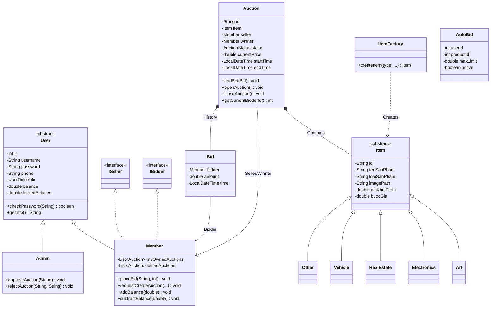
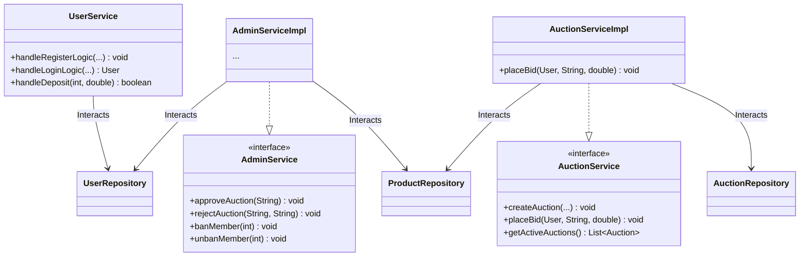
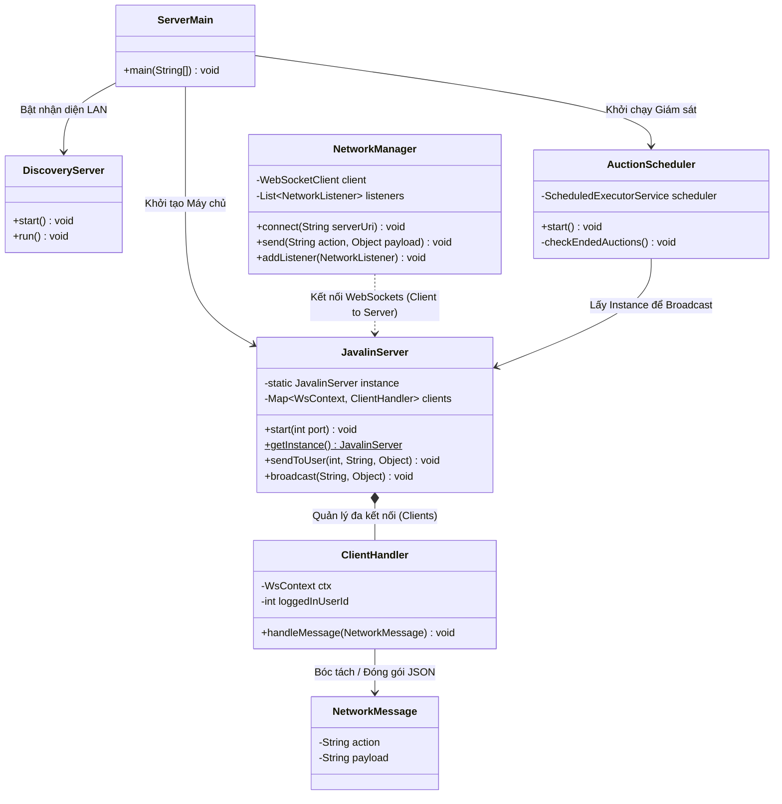

# 🔨 Hệ thống Đấu Giá Trực Tuyến (Online Auction System) - Nhóm 2

Dự án **Hệ thống Đấu Giá Trực Tuyến** là một hệ thống phần mềm toàn diện, áp dụng mô hình Client-Server. Hệ thống cung cấp nền tảng giao dịch tài sản theo thời gian thực (real-time bidding) với độ trễ thấp, minh bạch, bảo mật dữ liệu và kiến trúc hướng đối tượng chặt chẽ.

---

## 🎯 1. Mô tả bài toán và Phạm vi hệ thống

### 1.1. Bài toán đặt ra
Trong thời đại số, nhu cầu đấu giá các vật phẩm (Nghệ thuật, Điện tử, Bất động sản...) qua mạng đang tăng cao. Yêu cầu lớn nhất của một hệ thống đấu giá là **tính tức thời (real-time)**: khi một người đặt giá, tất cả những người tham gia khác phải ngay lập tức nhìn thấy giá mới nhất mà không cần tải lại trang, đồng thời hệ thống phải tự động tính toán thời gian, chống hành vi gian lận (snipping) và thanh toán một cách minh bạch.

### 1.2. Phạm vi hệ thống
Hệ thống được chia thành hai thực thể độc lập nhưng giao tiếp liên tục:
- **Server (Máy chủ - Backend):** Chịu trách nhiệm quản lý toàn bộ luồng nghiệp vụ. Nhận kết nối, quản lý các phiên bản WebSocket, đồng bộ hóa dữ liệu xuống MySQL, chạy tiến trình đếm ngược thời gian (`Scheduler`), và kích hoạt các lệnh thanh toán tự động khi phiên đấu giá khép lại.
- **Client (Máy khách - Frontend):** Được xây dựng bằng JavaFX, cung cấp giao diện tương tác trực quan cho 2 vai trò chính:
  - **Member (Người dùng):** Đăng ký/đăng nhập, quản lý ví tiền (số dư thực và số dư bị khóa), đăng tải sản phẩm, đặt giá thủ công hoặc thiết lập **Auto-bid** (hệ thống tự động trả giá thay người dùng).
  - **Admin (Quản trị viên):** Kiểm duyệt sản phẩm đăng bán (Duyệt/Từ chối), khóa/mở khóa các thành viên vi phạm, theo dõi biểu đồ thống kê tổng quan (doanh thu, số lượng người tham gia).

---

## 🚀 2. Công nghệ sử dụng, Môi trường chạy & Cài đặt

- **Công nghệ cốt lõi:**
  - **Ngôn ngữ:** Java 21 (Tận dụng Virtual Threads & tối ưu hóa luồng).
  - **Giao diện (Client):** JavaFX 21 (FXML + CSS tùy chỉnh UI hiện đại).
  - **Máy chủ & Mạng:** Javalin (cung cấp REST API & WebSocket cho giao tiếp thời gian thực 2 chiều).
  - **Cơ sở dữ liệu:** MySQL 8.0, truy xuất thông qua JDBC Driver thuần túy (Hiệu năng cao).
  - **Quản lý Database Migration:** Flyway (Tự động hóa việc tạo bảng và chèn dữ liệu mẫu ngay lần chạy đầu tiên).
  - **Xử lý dữ liệu:** Google Gson (Serialize/Deserialize đối tượng thành chuỗi JSON).
  - **Trình quản lý dự án & Build:** Apache Maven.
- **Môi trường chạy:** Tương thích đa nền tảng (Windows, macOS, Linux).
- **Yêu cầu cài đặt cơ bản:**
  - Máy tính đã cài đặt **Java JDK 21**.
  - Phần mềm **MySQL Server** đang chạy ngầm (Sử dụng cổng mặc định `3306`, user `root`, mật khẩu để trống. Bạn có thể thay đổi cấu hình này tại `src/main/java/Team2_CS2_Auction/util/DBConnection.java`).

---

## 📁 3. Cấu trúc thư mục và Module chính

Dự án áp dụng chặt chẽ mô hình **MVC (Model-View-Controller)** và thiết kế phân lớp (Layered Architecture):

```text
Team2_CS2_Auction/
 ├── Controller/   # (Controller) Các lớp điều khiển JavaFX. Lắng nghe sự kiện click, xử lý giao diện (UI) và gọi các Service.
 │    ├── Base_Admin_Controller.java     # Lớp cha chứa logic chuyển trang và menu.
 │    ├── Phien_Dau_Gia_Controller.java  # Màn hình phòng đấu giá trực tiếp (Real-time).
 │    └── ...
 ├── Model/        # (Model) Định nghĩa các thực thể dữ liệu cốt lõi, áp dụng OOP mạnh mẽ.
 │    ├── auction/ # Auction, Bid, AutoBid, AuctionStatus...
 │    ├── item/    # Item (Abstract), Art, Electronics... và ItemFactory.
 │    └── user/    # User (Abstract), Member, Admin, UserRole, IBidder, ISeller...
 ├── Networking/   # Xử lý giao tiếp mạng (LAN/Internet).
 │    ├── JavalinServer.java     # Server chính lắng nghe WebSocket và API.
 │    ├── ClientHandler.java     # Quản lý từng kết nối riêng lẻ của Client trên Server.
 │    ├── NetworkManager.java    # (Phía Client) Quản lý kết nối tới Server.
 │    ├── AuctionScheduler.java  # Vòng lặp ngầm 1 giây/lần kiểm tra phiên hết hạn.
 │    └── DiscoveryServer/Client # UDP Broadcast để tự động dò tìm IP Máy chủ trong mạng LAN.
 ├── Repository/   # Tương tác trực tiếp với Database bằng lệnh SQL.
 │    ├── AuctionRepositoryImpl.java # Cập nhật giá, thêm giao dịch, trừ/cộng tiền tự động.
 │    ├── UserRepository.java        # Xử lý số dư, đăng nhập.
 │    └── ...
 ├── Service/      # Tầng Business Logic (Nghiệp vụ). Kiểm tra điều kiện trước khi gọi Repository.
 │    ├── AuctionServiceImpl.java
 │    ├── UserServiceImpl.java
 │    └── AdminServiceImpl.java
 ├── Session/      # Quản lý phiên đăng nhập cục bộ trên RAM của ứng dụng Client (chứa CurrentUser).
 └── util/         # Các công cụ hỗ trợ (Mã hóa SHA-256, Kết nối DB, Validation...).
```

---

## 📊 4. Sơ đồ Kiến trúc & Lớp (Class Diagram - Chi tiết nhất)

Hệ thống được chia thành 4 phân hệ chính theo chiều dọc để đảm bảo sự tách bạch, to và rõ ràng.

### 4.1. Phân hệ 1: Mô hình Dữ liệu Cốt lõi (Core Domain Model)
*Áp dụng tính Đa hình (Polymorphism), Kế thừa (Inheritance) và Factory Pattern để khởi tạo linh hoạt các sản phẩm.*



### 4.2. Phân hệ 2: Lớp Truy xuất Dữ liệu (Repository Layer)
*Chịu trách nhiệm trực tiếp gọi câu lệnh JDBC (INSERT, UPDATE, SELECT), kiểm soát Transaction và toàn vẹn số liệu tài chính.*


### 4.3. Phân hệ 3: Lớp Nghiệp Vụ (Service Layer)
*Cầu nối giữa Controller và Repository. Kiểm tra điều kiện (ví dụ: Số dư khả dụng có đủ để tham gia AutoBid không, mật khẩu có hợp lệ không) trước khi cấp quyền truy xuất.*



### 4.4. Phân hệ 4: Mạng, Máy chủ & Trạm điều phối (Networking & Scheduler)
*Xử lý toàn bộ logic đồng bộ thời gian thực (WebSocket) và tiến trình giám sát kết thúc phiên tự động.*



---

## 💿 5. Vị trí các file .jar (Build Products)

Mã nguồn sau khi được hệ thống Maven biên dịch và đóng gói (Build) sẽ tạo ra các tệp thực thi độc lập (Fat JAR). Các tệp này sẽ nằm trực tiếp trong thư mục `target/` của dự án:
- **Tệp Máy chủ (Server):** `target/MyAuctionApp-1.0-SNAPSHOT-server.jar`
- **Tệp Máy khách (Client):** `target/MyAuctionApp-1.0-SNAPSHOT-client.jar`

*(Lưu ý: Nếu bạn chưa tiến hành build, thư mục `target` có thể không tồn tại hoặc không chứa các tệp này. Hãy xem Bước 6 để tự động biên dịch và chạy).*

---

## 🎯 6. Hướng dẫn chạy Server/Client theo thứ tự cụ thể

Luồng kiến trúc bắt buộc **Máy chủ (Server) phải được vận hành trước** để mở cổng kết nối, sau đó Máy khách (Client) mới có thể kết nối vào. Hệ thống sử dụng công nghệ cấp phát IP tự động (UDP Discovery), do đó máy khách không cần cấu hình cấu trúc IP nếu cùng chung mạng WiFi.

### 🛠️ Cách ưu tiên: Chạy trực tiếp qua lệnh Maven (Trên Code Editor/Terminal)

**Bước 1: Khởi động Server (Bộ não hệ thống)**
- Mở terminal/cmd tại thư mục gốc của dự án (`Team2_CS2_Auction`).
- Nhập lệnh sau và nhấn Enter:
```bash
.\mvnw.cmd clean compile exec:java -Dexec.mainClass="Team2_CS2_Auction.Networking.ServerMain"
```
*(Ghi chú: Lần chạy đầu tiên, thư viện Flyway sẽ tự động kết nối vào MySQL và xây dựng toàn bộ cơ sở dữ liệu `auction_db`. Máy chủ sẽ in ra thông báo: `IP CỦA MÁY CHỦ (LAN): 192.168.1.xxx:8080`).*

**Bước 2: Khởi động Client (Giao diện người dùng)**
- Mở thêm một tab Terminal MỚI (hoặc mở trên máy tính khác cùng mạng WiFi).
- Nhập lệnh sau và nhấn Enter:
```bash
.\mvnw.cmd clean compile exec:java -Dexec.mainClass="Team2_CS2_Auction.Main"
```
*(Ghi chú: Ứng dụng Client sẽ hiện lên giao diện. Nhờ hệ thống Discovery Client, nó sẽ tự động nhận diện IP của Máy chủ và đưa bạn thẳng vào màn hình Đăng Nhập. Nếu tường lửa chặn UDP, nó sẽ hiện bảng yêu cầu bạn điền thủ công IP lấy từ Bước 1).*

### 📦 Cách phụ trợ: Chạy từ các file `.jar` đã build sẵn
Nếu bạn đã sở hữu file build ở Mục 5, bạn chỉ cần mở Command Prompt và gõ tuần tự:
1. `java -jar target/MyAuctionApp-1.0-SNAPSHOT-server.jar`
2. `java -jar target/MyAuctionApp-1.0-SNAPSHOT-client.jar`

---

## 🏆 7. Danh sách chức năng ĐÃ HOÀN THÀNH (Đầy đủ 100%)

Hệ thống đã vượt qua các bộ kiểm thử tự động (Unit Test) và kiểm tra chức năng hoàn thiện với các điểm nhấn đặc biệt:

- [x] **Hệ thống Định danh:** Đăng nhập/Đăng ký phân quyền chặt chẽ giữa Member và Admin. Hỗ trợ mã hóa mật khẩu an toàn.
- [x] **Hệ thống Tài chính giả lập:** Người dùng có thể yêu cầu nạp tiền, quản lý **Số dư thực (Balance)** và **Số dư tạm giữ (Locked Balance - khi tham gia đấu giá)**.
- [x] **Giao thương:** Người dùng tạo yêu cầu đăng bán sản phẩm (với đa dạng phân loại: Nghệ thuật, Bất động sản, Đồ điện tử...). Sản phẩm vào trạng thái chờ (Pending) cho đến khi Admin duyệt.
- [x] **Quản trị (Admin Panel):** Giao diện riêng biệt cho Admin. Cho phép Duyệt/Từ chối sản phẩm, Khóa (Ban) người dùng vi phạm, xem Biểu đồ thống kê lợi nhuận, lượt tham gia toàn sàn.
- [x] **Đấu giá Thời gian thực (WebSockets):** Mọi lệnh "Đặt Giá" của một người đều lập tức hiển thị lên màn hình của **tất cả người dùng khác** ở bất cứ đâu trong mạng LAN mà không cần F5 tải lại trang.
- [x] **Auto-Bid (Trợ lý Đấu giá Tự động):** Người dùng bận rộn có thể điền "Giá Trần" (Max Limit). Khi có đối thủ trả giá cao hơn, Máy chủ lập tức tự động đặt một lệnh giá mới thay mặt người dùng để vượt mặt đối thủ trong giới hạn cho phép.
- [x] **Anti-Snipping (Chống canh me cuối giờ):** Nếu một lệnh đặt giá thành công khi đồng hồ chỉ còn dưới 45 giây, hệ thống lập tức tự động cộng thêm 45 giây vào tổng thời gian, tạo cơ hội cho người bị vượt giá phản hồi.
- [x] **Thanh toán tự động 100%:** Luồng `AuctionScheduler` đếm ngược chính xác. Khi hết giờ, hệ thống ngầm tự động trừ tiền của người thắng, cộng tiền cho người bán, giải phóng số dư (Unlock Balance) cho những người thua và **phát tín hiệu WebSocket cập nhật số dư ngay lập tức lên màn hình** của người mua và người bán.

---

## 📽️ 8. Link Báo cáo PDF và Video Demo
*Bộ tài liệu hoàn thiện dùng để đánh giá và chấm điểm đồ án:*

- **Link báo cáo PDF chi tiết:** [https://drive.google.com/file/d/1OQDIAngdbkVYpS8ketRBNth_3qxYRFD9/view?usp=sharing]
- **Link Video Hướng dẫn & Trình diễn thực tế:** [https://drive.google.com/file/d/1OQDIAngdbkVYpS8ketRBNth_3qxYRFD9/view?usp=sharing]

> ***Dự án được xây dựng với tâm huyết và áp dụng các mẫu thiết kế (Design Patterns) chuẩn xác nhất của kiến trúc phần mềm doanh nghiệp.***
